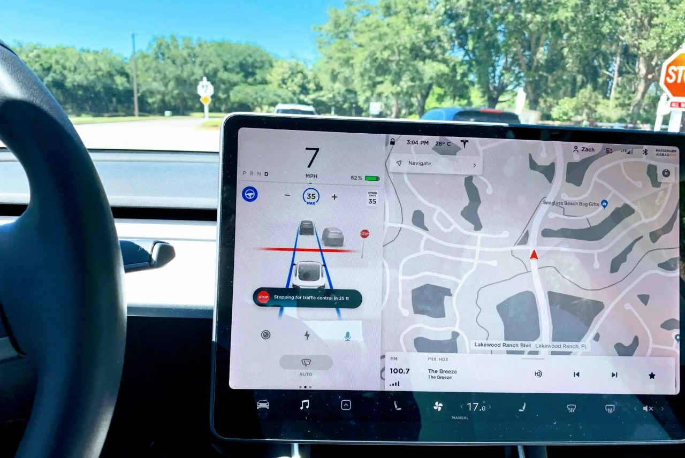
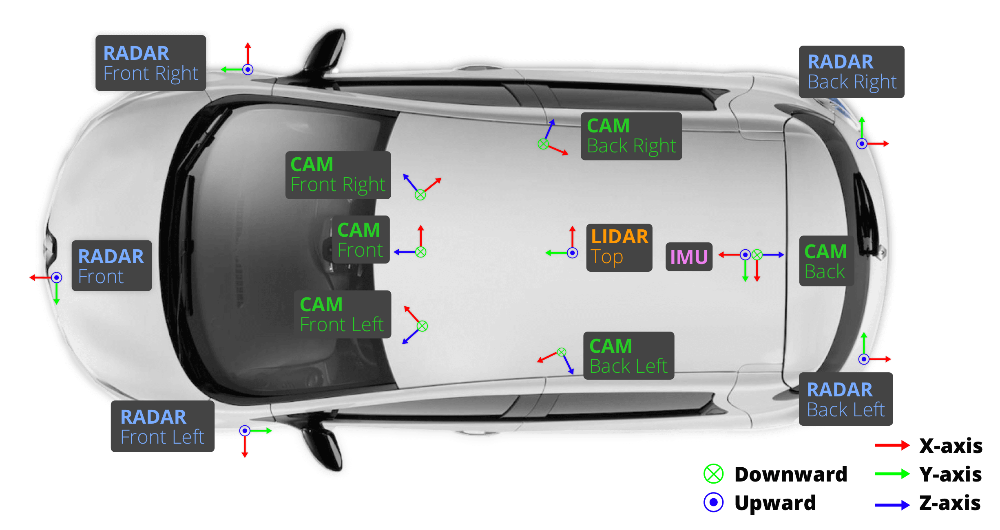
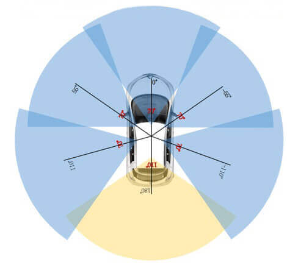
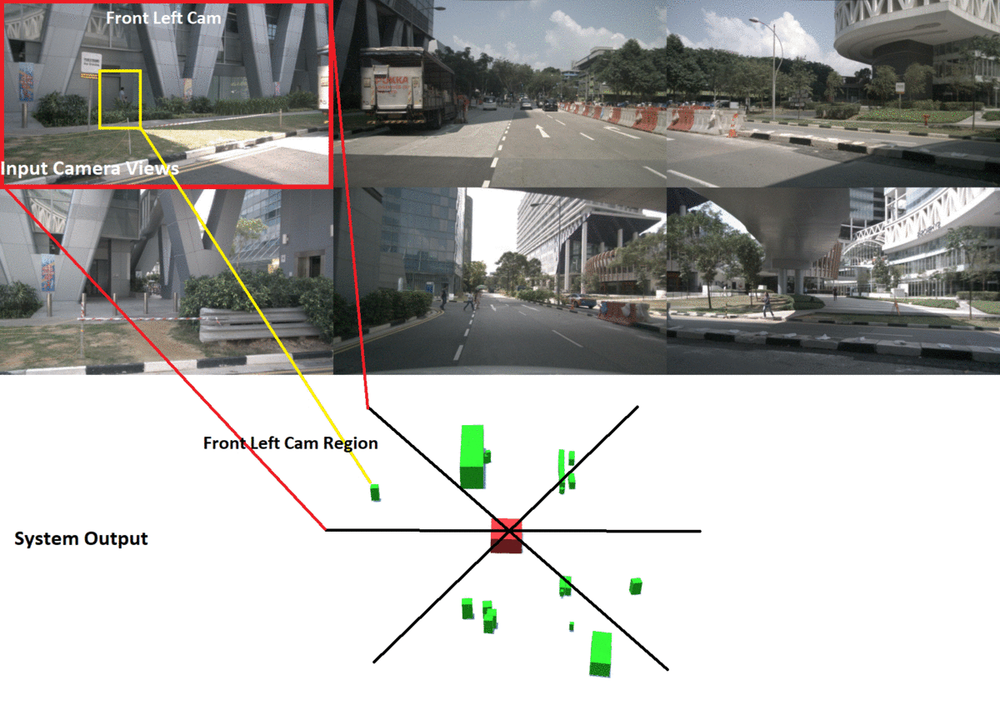
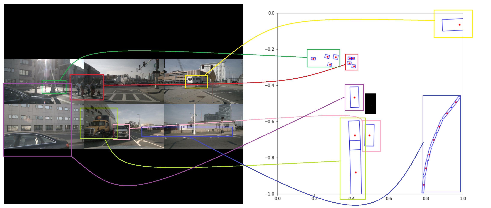
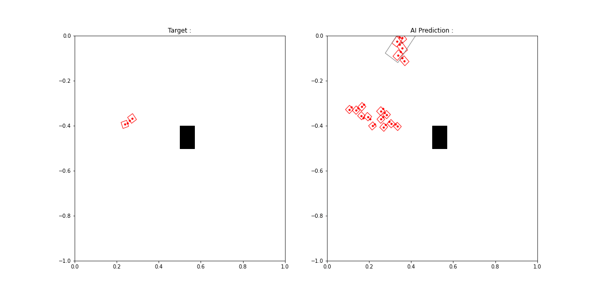
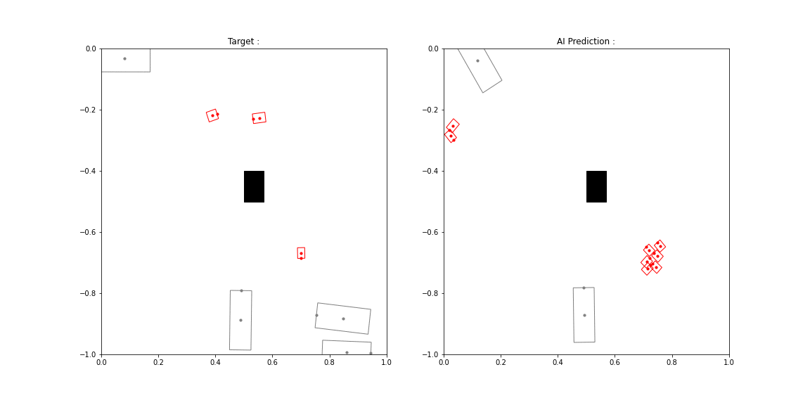
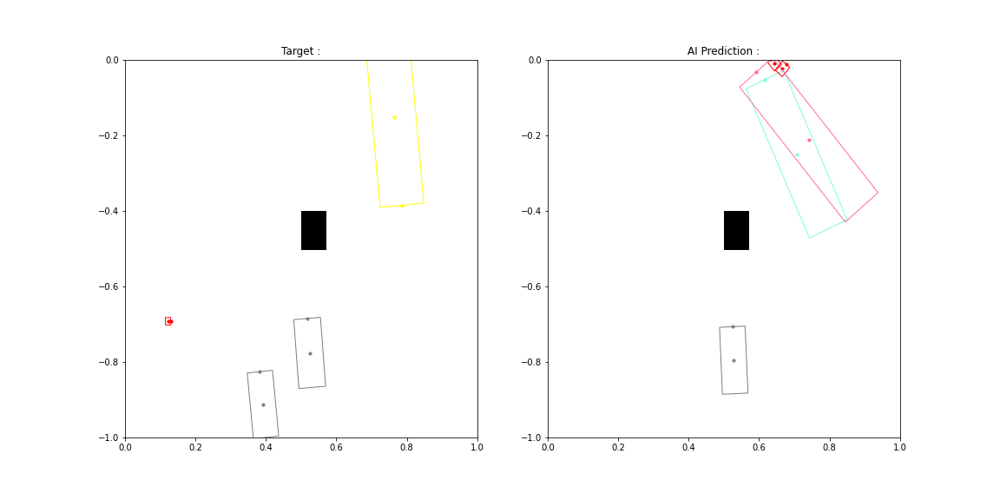
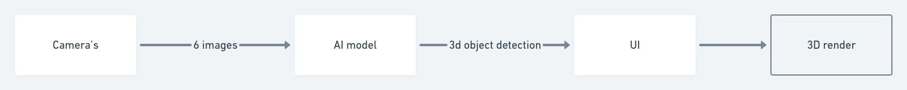

# Blind Spot Monitoring System through real time Birdseye view render
An AI Capable of 3d Object detection and an UI that reders the detected objects into birdseye view is developed.

The Dataset used : https://www.nuscenes.org

Sensor suit and camera coverage in the dataset

Input from Dataset and System Output:

# Index
->AI Sample Outputs 
->System Overview 
->Repo Layout

# AI Sample Outputs:
AI input output mapping:

Sample Predictions:

more ai sample outputs from the test dataset can be found in the AI/assets folder

# System Overview

AI Model Architecture : 
The AI model uses a Modified Yolo v3 in which the six images from the 6 cameras is feed through 6 different feature extraction networks(Darknet) and the output from these feature extraction networks are stacked back to back and feed to a object detector which instead of just predicting the x,y, l,w ,conf and category like the usual yolo network , it predicts x,y,z h,w,l, r1,r2 conf, category where z is the z coordinate of the centroid, h for the height of the object and r1,r2 for the orientation of the object where r1 is the sine and r2 is the cosine of the original orientation.

The images used for traing the model was of size 416x416 and was predicting objects in a 13 meter radius

# Repo Layout

The code for the AI model is present in the AI/Birdnet_Yolo.ipynb python notebook and the configuration file in the AI/config/birdnet-yolo.cfg

Trained weight for the AI model can be found in the AI/weights folder

